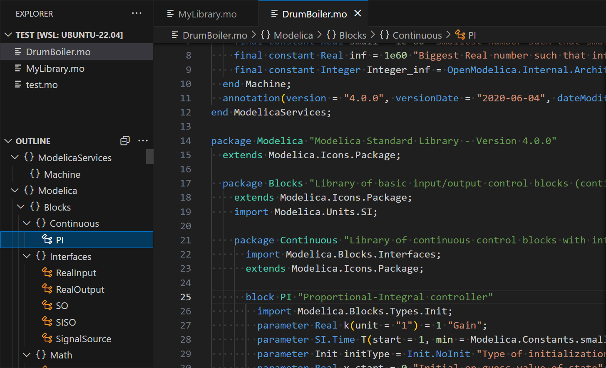
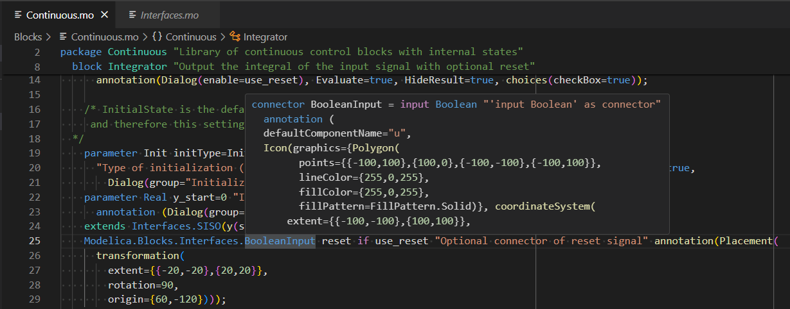
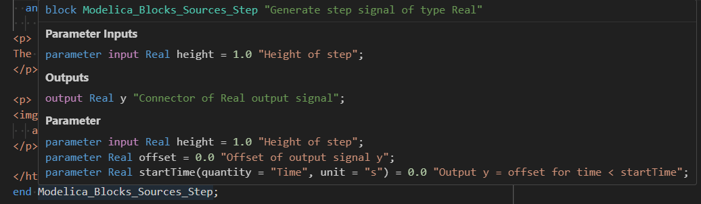

# Modelica Language Server

[![Build][badge-build]][workflow-test]

A very early version of a Modelica Language Server based on
[OpenModelica/tree-sitter-modelica][tree-sitter-modelica].

For syntax highlighting install enxtension
[AnHeuermann.metamodelica][ext-metamodelica]
in addition.

## Functionality

This Language Server works for Modelica files. It has the following language
features:

- Provide Outline of Modelica files.

  

- Goto declarations.

  

- Hover provider for declared symbols.

  

## Configuration

### Loading external Modelica libraries

To make the language server aware of libraries outside your workspace (such as
the Modelica Standard Library), add their root directories to
`modelica.libraries` in your VS Code settings.

**Workspace settings** (`.vscode/settings.json`):

```json
{
  "modelica.libraries": [
    "/path/to/Modelica 4.0.0+maint.om"
  ]
}
```

**User settings** (via *File → Preferences → Settings*, search for
`modelica.libraries`): click *Add Item* and enter the path to each library
root directory — the folder that contains a `package.mo` file.

Typical paths:

| Platform | Default OpenModelica library location    |
|----------|------------------------------------------|
| Linux    | `~/.openmodelica/libraries/`             |
| Windows  | `%APPDATA%\OpenModelica\libraries\`      |
| macOS    | `~/.openmodelica/libraries/`             |

The server loads all configured libraries at startup, and also picks up
libraries added later without a restart: adding a workspace folder, or
pushing an updated `modelica.libraries` list via
`workspace/didChangeConfiguration`, loads the new library into the running
session. Removing a workspace folder does not unload its library yet; a
restart is still required for that.

## Installation

### Via Marketplace

- [Visual Studio Marketplace][marketplace]
- [Open VSX Registry][open-vsx]

### Via VSIX File

Download the latest
[modelica-language-server-0.2.2.vsix][vsix-download]
from the
[releases][releases]
page.

Check the [VS Code documentation][vscode-install-vsix]
on how to install a .vsix file.
Use the `Install from VSIX` command or run

```bash
code --install-extension modelica-language-server-0.2.2.vsix
```

## Contributing ❤️

Contributions are very welcome!

We made the first tiny step but need help to add more features and refine the
language server.

If you are searching for a good point to start
check the
[good first issue][good-first-issue].
To see where the development is heading to check the
[Projects section][projects].
If you need more information start a discussion over at
[OpenModelica/OpenModelica][openmodelica].

Found a bug or having issues? Open a
[new issue][new-issue].

## Structure

```txt
.
├── client // Language Client
│   ├── src
│   │   ├── test // End to End tests for Language Client / Server
│   │   └── extension.ts // Language Client entry point
├── package.json // The extension manifest.
└── server // Modelica Language Server
    └── src
        └── server.ts // Language Server entry point
```

## Building the Language Server

- Run `npm install` and `npm run postinstall` in this folder.This installs all
  necessary npm modules in both the client and server folder
- Open VS Code on this folder.
- Press Ctrl+Shift+B to start compiling the client and server in [watch
  mode][vscode-watch-mode].
- Switch to the Run and Debug View in the Sidebar (Ctrl+Shift+D).
- Select `Launch Client` from the drop down (if it is not already).
- Press ▷ to run the launch config (F5).
- In the [Extension Development Host][ext-dev-host]
  instance of VSCode, open a document in 'modelica' language mode.
  - Check the console output of `Language Server Modelica` to see the parsed
    tree of the opened file.

## Build and Install Extension

```bash
npx vsce package
```

## License

modelica-language-server is licensed under the OSMC Public License v1.8, see
[OSMC-License.txt](./OSMC-License.txt).

### 3rd Party Licenses

This extension is based on
[https://github.com/microsoft/vscode-extension-samples/tree/main/lsp-sample][lsp-sample],
licensed under MIT license.

Some parts of the source code are taken from
[bash-lsp/bash-language-server][bash-language-server],
licensed under the MIT license and adapted to the Modelica language server.

[OpenModelica/tree-sitter-modelica][tree-sitter-modelica]
v0.2.0 is included in this extension and is licensed under the [OSMC-PL
v1.8](./server/OSMC-License.txt).

## Acknowledgments

This package was initially developed by
[Hochschule Bielefeld - University of Applied Sciences and Arts](hsbi.de).

[badge-build]: https://github.com/OpenModelica/modelica-language-server/actions/workflows/test.yml/badge.svg
[bash-language-server]: https://github.com/bash-lsp/bash-language-server
[ext-dev-host]: https://code.visualstudio.com/api/get-started/your-first-extension#:~:text=Then%2C%20inside%20the%20editor%2C%20press%20F5.%20This%20will%20compile%20and%20run%20the%20extension%20in%20a%20new%20Extension%20Development%20Host%20window.
[ext-metamodelica]: https://marketplace.visualstudio.com/items?itemName=AnHeuermann.metamodelica
[good-first-issue]: https://github.com/OpenModelica/modelica-language-server/labels/good%20first%20issue
[lsp-sample]: https://github.com/microsoft/vscode-extension-samples/tree/main/lsp-sample
[marketplace]: https://marketplace.visualstudio.com/items?itemName=OpenModelica.modelica-language-server
[new-issue]: https://github.com/OpenModelica/modelica-language-server/issues/new/choose
[open-vsx]: https://open-vsx.org/extension/OpenModelica/modelica-language-server
[openmodelica]: https://github.com/OpenModelica/OpenModelica
[projects]: https://github.com/OpenModelica/modelica-language-server/projects?query=is%3Aopen
[releases]: https://github.com/OpenModelica/modelica-language-server/releases
[tree-sitter-modelica]: https://github.com/OpenModelica/tree-sitter-modelica
[vscode-install-vsix]: https://code.visualstudio.com/docs/editor/extension-marketplace#_install-from-a-vsix
[vscode-watch-mode]: https://code.visualstudio.com/docs/editor/tasks#:~:text=The%20first%20entry%20executes,the%20HelloWorld.js%20file.
[vsix-download]: https://github.com/OpenModelica/modelica-language-server/releases/download/v0.2.2/modelica-language-server-0.2.2.vsix
[workflow-test]: https://github.com/OpenModelica/modelica-language-server/actions/workflows/test.yml
