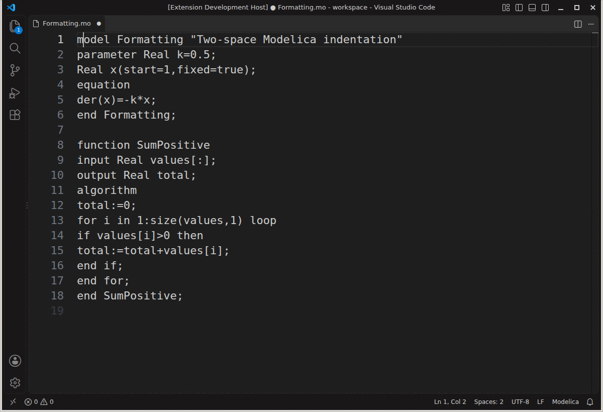

# Modelica Language Server

[![Build][badge-build]][workflow-test]
[![Coverage Status][badge-coverage]][coverage-project]

A very early version of a Modelica Language Server based on
[OpenModelica/tree-sitter-modelica][tree-sitter-modelica].

For syntax highlighting install extension
[AnHeuermann.metamodelica][ext-metamodelica]
in addition.

## Functionality

This Language Server works for Modelica files. It has the following language
features:

- Provide Outline of Modelica files.

  

- Optional Modelica syntax diagnostics, **off by default**. Enable with
  `"modelica.diagnostics.syntax": true` in VS Code settings. The toggle takes
  effect without restarting; disabling cancels queued checks and clears errors.
  Other LSP clients can set `initializationOptions.diagnostics.syntax` or send
  `settings.modelica.diagnostics.syntax` in a configuration change.
  Diagnostics in open documents are updated after a short typing
  pause and cleared when fixed or closed. Errors come from the bundled
  tree-sitter grammar, with up to 100 reports per document. Missing tokens are
  marked at their insertion point. Grammar limitations can affect the results;
  these are not compiler/type checks and do not validate embedded HTML or XML.
  A shared queue coalesces edits for 150 ms and checks one document at a time,
  yielding at least 25 ms between files. Closing a document cancels queued work.
  Checks do not scan unopened libraries or retain additional syntax trees.

- Goto declarations.

  

- Optional autocomplete, **off by default**. Enable with
  `"modelica.completion.enabled": true`; changes take effect without restarting.
  Other LSP clients can use `initializationOptions.completion.enabled` or
  `settings.modelica.completion.enabled` in a configuration change.
  Suggests direct declarations, built-in types, explicit imports, and qualified
  class/package members, including library files after a dot. Suggestions use
  unsaved text and replace the current word. Comments and strings are excluded.
  Only requested library paths are loaded; sibling filenames are listed without
  parsing their contents. Disabled requests do no completion parsing or loading.
  VS Code's independent word-based suggestions are controlled by
  `editor.wordBasedSuggestions`, not this setting.
  Results are limited to 200, with further requests when the prefix narrows.

  This is basic completion, not compiler-level semantic analysis. Broader scope,
  inheritance/redeclarations, aliases and instance-member resolution are tracked
  in [#92](https://github.com/OpenModelica/modelica-language-server/issues/92),
  snippets in [#93](https://github.com/OpenModelica/modelica-language-server/issues/93),
  and automatic imports in [#94](https://github.com/OpenModelica/modelica-language-server/issues/94).

- Hover provider for declared symbols.

  

- Semantic highlighting for locally resolved classes and types, including their
  matching `end` names. Packages are classified as namespaces, records as structs,
  functions as functions, enumeration types as enums, other `type` declarations
  as types, and models/blocks/connectors/classes as classes. Declarations carry
  the `declaration` modifier; references and `end` names use the same token type.

  Tokens use the current unsaved document and do not load or scan libraries.
  Unknown external/imported/inherited names retain ordinary syntax highlighting.
  This complements the MetaModelica extension's syntax grammar. Colors depend on
  the theme; VS Code's `editor.semanticHighlighting.enabled` setting controls
  semantic coloring (set it to `true` to enable it regardless of theme).
  Other LSP clients can request `textDocument/semanticTokens/full` using the
  advertised legend. Range and delta token requests are not implemented.

- Optional document highlights, **off by default**. Enable
  `"modelica.documentHighlights.enabled": true` to highlight a symbol's declaration
  and references in the current document when placing the cursor on it. The
  setting changes live; other LSP clients can use
  `initializationOptions.documentHighlights.enabled` or
  `settings.modelica.documentHighlights.enabled` in a configuration change.
  Each request uses the latest unsaved buffer, without loading libraries or
  scanning other open documents. Disabled requests skip highlight parsing.
  Temporary syntax trees are released after each request.

  Supports local classes (including their `end` names), components, explicit
  import bindings, enumeration literals, and loop/comprehension indices. Local
  instance members are matched through locally declared types. Shadowed names,
  comments and strings are not merged. Unresolved external/inherited members,
  wildcard imports and type aliases are not guessed. Highlights use neutral
  `Text` ranges rather than assigning read/write meaning to Modelica equations.
  An editor may still show its own textual occurrence highlighting when the
  LSP feature is disabled.

- Format Document and Format Selection, using two-space Modelica indentation by
  default. Editor indentation options override this default. Formatting adjusts
  whitespace, spaces around operators and after commas, and wraps long argument
  lists at a target width of 100 columns (a soft limit). Section headings align
  with their class headers, as in the Modelica Standard Library.

  Selection formatting covers the selected lines and uses the surrounding code
  to determine indentation. Strings (including XML/HTML documentation) are preserved
  by default. Comments and declaration order are preserved. Inputs and outputs are not reordered,
  since that can change positional function calls. Files rejected by the bundled
  Modelica grammar are left untouched. Other LSP clients can supply `printWidth`
  as an additional formatting option.

  With `modelica.formatting.formatDocumentation` off (the default), embedded
  XML/HTML is preserved exactly, including whitespace, escaped quotes and line
  endings. Only the surrounding Modelica annotation syntax is formatted.

  To opt in to documentation formatting, add this to your VS Code settings:

  ```json
  {
    "modelica.formatting.formatDocumentation": true
  }
  ```

  The setting applies to Format Document and Format Selection without restarting
  the server. Complete literal `Documentation(info="...", revisions="...")`
  values are delegated to the HTML language service for `<html>` documents
  (including an optional HTML doctype), or an XML formatter for other XML markup.
  Ordinary strings, concatenated documentation and partially selected string
  literals are left unchanged. XML that cannot be parsed is preserved. This is
  formatting, not syntax checking; diagnostics are tracked in [#87][html-diagnostics]
  and [#88][xml-diagnostics].

  Other LSP clients can set `initializationOptions.formatting.formatDocumentation`,
  send `settings.modelica.formatting.formatDocumentation` in a configuration
  change, or pass `formatDocumentation` in a formatting request's `options`.
  An explicit per-request boolean overrides the server setting, so a client can
  disable markup formatting for an individual request even when it is enabled.

  

  To try it in VS Code:

  1. If the window is in Restricted Mode, open **Manage Workspace Trust** and
     trust the folder if you trust its contents.
  2. Open a `.mo` file and check that its language mode is **Modelica**.
  3. Press **F1**, type **Format Document**, and press **Enter**. If prompted,
     choose **Modelica Language Server** as the formatter.
  4. To format only part of a file, select the lines and run **Format Selection**.

  [View or download the formatting GIF](images/formatting_demo.gif).

[html-diagnostics]: https://github.com/OpenModelica/modelica-language-server/issues/87
[xml-diagnostics]: https://github.com/OpenModelica/modelica-language-server/issues/88

## Configuration

### Loading external Modelica libraries

To make the language server aware of libraries outside your workspace (such as
the Modelica Standard Library), add their root directories to
`modelica.libraries` in your VS Code settings.

**Workspace settings** (`.vscode/settings.json`):

```json
{
  "modelica.libraries": [
    "/path/to/Modelica 4.0.0+maint.om"
  ]
}
```

**User settings** (via *File → Preferences → Settings*, search for
`modelica.libraries`): click *Add Item* and enter the path to each library
root directory — the folder that contains a `package.mo` file.

Typical paths:

| Platform | Default OpenModelica library location    |
|----------|------------------------------------------|
| Linux    | `~/.openmodelica/libraries/`             |
| Windows  | `%APPDATA%\OpenModelica\libraries\`      |
| macOS    | `~/.openmodelica/libraries/`             |

The server loads all configured libraries at startup, and also picks up
libraries added later without a restart: adding a workspace folder, or
pushing an updated `modelica.libraries` list via
`workspace/didChangeConfiguration`, loads the new library into the running
session. Removing a workspace folder does not unload its library yet; a
restart is still required for that.

## Installation

### Via Marketplace

- [Visual Studio Marketplace][marketplace]
- [Open VSX Registry][open-vsx]

### Via VSIX File

Download the latest
[modelica-language-server-0.2.2.vsix][vsix-download]
from the
[releases][releases]
page.

Check the [VS Code documentation][vscode-install-vsix]
on how to install a .vsix file.
Use the `Install from VSIX` command or run

```bash
code --install-extension modelica-language-server-0.2.2.vsix
```

## Contributing ❤️

Contributions are very welcome!

We made the first tiny step but need help to add more features and refine the
language server.

If you are searching for a good point to start
check the
[good first issue][good-first-issue].
To see where the development is heading to check the
[Projects section][projects].
If you need more information start a discussion over at
[OpenModelica/OpenModelica][openmodelica].

Found a bug or having issues? Open a
[new issue][new-issue].

## Structure

```txt
.
├── client // Language Client
│   ├── src
│   │   ├── test // End to End tests for Language Client / Server
│   │   └── extension.ts // Language Client entry point
├── package.json // The extension manifest.
└── server // Modelica Language Server
    └── src
        └── server.ts // Language Server entry point
```

## Building the Language Server

- Run `npm install` and `npm run postinstall` in this folder.This installs all
  necessary npm modules in both the client and server folder
- Open VS Code on this folder.
- Press Ctrl+Shift+B to start compiling the client and server in [watch
  mode][vscode-watch-mode].
- Switch to the Run and Debug View in the Sidebar (Ctrl+Shift+D).
- Select `Launch Client` from the drop down (if it is not already).
- Press ▷ to run the launch config (F5).
- In the [Extension Development Host][ext-dev-host]
  instance of VSCode, open a document in 'modelica' language mode.
  - Check the console output of `Language Server Modelica` to see the parsed
    tree of the opened file.

## Semantic highlighting tests

`npm run esbuild && npm run test:server` runs the server and protocol tests;
`npm run test:e2e` also checks token types and unsaved edits in VS Code.
To repeat the editor tests with MetaModelica's syntax grammar installed, use a
separate extension directory (replace `/path/to/code` with a VS Code CLI):

```bash
/path/to/code --extensions-dir /tmp/modelica-test-extensions --install-extension AnHeuermann.metamodelica@1.6.1
MODELICA_TEST_EXTENSIONS_DIR=/tmp/modelica-test-extensions MODELICA_TEST_METAMODELICA=1 npm run test:e2e
```

The coexistence run asserts that MetaModelica is installed and contributes the
Modelica grammar, then verifies the same semantic tokens through VS Code.
It does not assert theme-specific pixel colors. To use an already downloaded
VS Code build, set `VSCODE_TEST_EXECUTABLE_PATH` to its executable.

## MSL sanity

The separate **MSL sanity** CI job checks every `.mo` file in the pinned MSL
4.1.0 release with the syntax diagnostic collector. This includes example
models embedded inside larger package files, not just `Examples/` directories.
Any syntax diagnostic, parser failure or missing library fails the job; there
is no allowlist. Files are checked sequentially and temporary trees are freed.
This is a grammar sanity check, not compilation or simulation of the examples.

To run it locally after installing the server dependencies:

```bash
npm --prefix server run test:msl -- /path/to/ModelicaStandardLibrary/Modelica
```

## Build and Install Extension

```bash
npx vsce package
```

## License

modelica-language-server is licensed under the OSMC Public License v1.8, see
[OSMC-License.txt](./OSMC-License.txt).

### 3rd Party Licenses

This extension is based on
[https://github.com/microsoft/vscode-extension-samples/tree/main/lsp-sample][lsp-sample],
licensed under MIT license.

Some parts of the source code are taken from
[bash-lsp/bash-language-server][bash-language-server],
licensed under the MIT license and adapted to the Modelica language server.

[OpenModelica/tree-sitter-modelica][tree-sitter-modelica]
v0.2.3 is included in this extension and is licensed under the [OSMC-PL
v1.8](./server/OSMC-License.txt).

## Acknowledgments

This package was initially developed by
[Hochschule Bielefeld - University of Applied Sciences and Arts](hsbi.de).

[badge-build]: https://github.com/OpenModelica/modelica-language-server/actions/workflows/test.yml/badge.svg
[badge-coverage]: https://coveralls.io/repos/github/OpenModelica/modelica-language-server/badge.svg?branch=main
[bash-language-server]: https://github.com/bash-lsp/bash-language-server
[coverage-project]: https://coveralls.io/github/OpenModelica/modelica-language-server?branch=main
[ext-dev-host]: https://code.visualstudio.com/api/get-started/your-first-extension#:~:text=Then%2C%20inside%20the%20editor%2C%20press%20F5.%20This%20will%20compile%20and%20run%20the%20extension%20in%20a%20new%20Extension%20Development%20Host%20window.
[ext-metamodelica]: https://marketplace.visualstudio.com/items?itemName=AnHeuermann.metamodelica
[good-first-issue]: https://github.com/OpenModelica/modelica-language-server/labels/good%20first%20issue
[lsp-sample]: https://github.com/microsoft/vscode-extension-samples/tree/main/lsp-sample
[marketplace]: https://marketplace.visualstudio.com/items?itemName=OpenModelica.modelica-language-server
[new-issue]: https://github.com/OpenModelica/modelica-language-server/issues/new/choose
[open-vsx]: https://open-vsx.org/extension/OpenModelica/modelica-language-server
[openmodelica]: https://github.com/OpenModelica/OpenModelica
[projects]: https://github.com/OpenModelica/modelica-language-server/projects?query=is%3Aopen
[releases]: https://github.com/OpenModelica/modelica-language-server/releases
[tree-sitter-modelica]: https://github.com/OpenModelica/tree-sitter-modelica
[vscode-install-vsix]: https://code.visualstudio.com/docs/editor/extension-marketplace#_install-from-a-vsix
[vscode-watch-mode]: https://code.visualstudio.com/docs/editor/tasks#:~:text=The%20first%20entry%20executes,the%20HelloWorld.js%20file.
[vsix-download]: https://github.com/OpenModelica/modelica-language-server/releases/download/v0.2.2/modelica-language-server-0.2.2.vsix
[workflow-test]: https://github.com/OpenModelica/modelica-language-server/actions/workflows/test.yml
